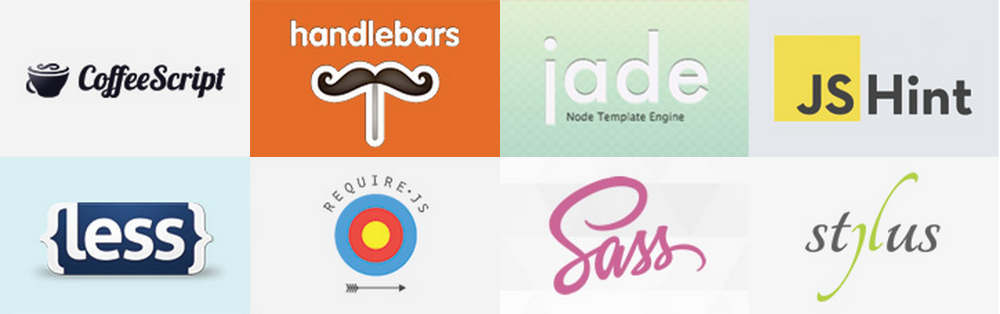

htmltitle: The State of Grunt
class: center, middle, title

#GruntJS - In 3 Steps
## October 2014

.right[
    Philip Saa  
    @cowglow
]
---
class: center, middle
# What is GruntJS?

---
class: orange
# GruntJS is

### Task Automation
### Distributed via NPM
### Growing Community (Plugins Developers)



---
class: center, middle
# How do I get started?

---
class: brown
#Step 1 - Gruntfile.js

### Load Tasks
.smaller[.smaller[
```javascript
 grunt.loadNpmTasks('grunt-contrib-__plugin__'); ```

```javascript
 require('load-grunt-tasks')(grunt); ```
]]

### Configure Plug-ins
.smaller[.smaller[ 
```javascript
 grunt.initConfig({}); ```
```javascript
 pkg: grunt.file.readJSON("package.json") ```
]]

### Register Tasks

---
class: orange
# Step 2 - Configure Plug-ins

### Grunt Team Contributions 
.smaller[.smaller[
* grunt-contrib-clean
* grunt-contrib-less
* grunt-contrib-concat
* grunt-contrib-uglify
* grunt-contrib-watch
]]

### Public Contributions
.smaller[.smaller[
* grunt-mkdir
* grunt-processhtml
]]
---
class: brown
# Step 3 - Register Tasks

### Tasks
.smaller[.smaller[
 ```javascript
grunt.registerTask('default', function(){
    /* some logic */
});```
]]

### Alias Tasks
.smaller[.smaller[ 
```javascript
 grunt.registerTask('default', ['__tasks__']); ```
]]

---
class: center, middle
# The State of Grunt

### Ben Alman (Bocoup)
http://cowboy.github.io/state-of-grunt-fe-summit-2014-talk/

---
class: orange
# Grunt vs the Alternatives

### Grunt - _“The JavaScript Task Runner”_
### Gulp - _“The streaming build system”_
### Broccoli - _“Fast client-side asset builder”_

--
#### They're actually all good options. 
#### As long as you're using SOMETHING, you're ahead of the game!

---
# Closing Remarks

.smaller[
* [GruntJS Documentation](http://gruntjs.com/getting-started)
* Follow on Twitter [@gruntjs](https://twitter.com/gruntjs)
]

<br><br>

.center[ 
    ## Danke  
    Philip Saa
    @cowglow
]